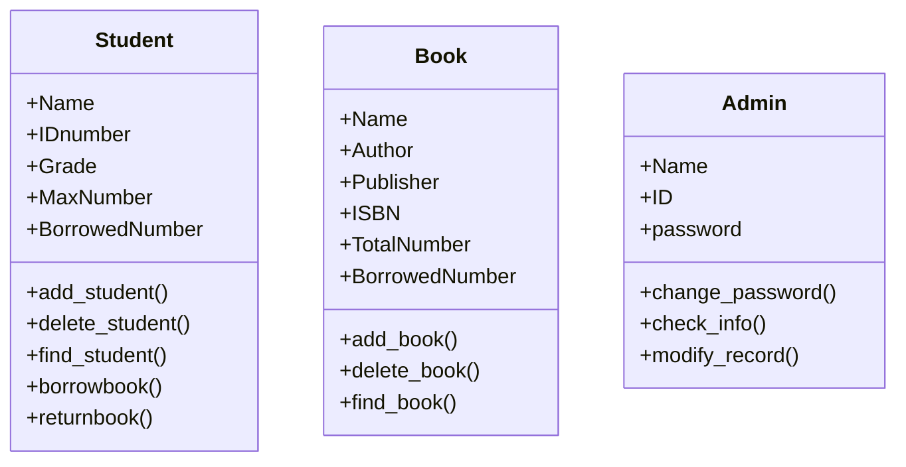
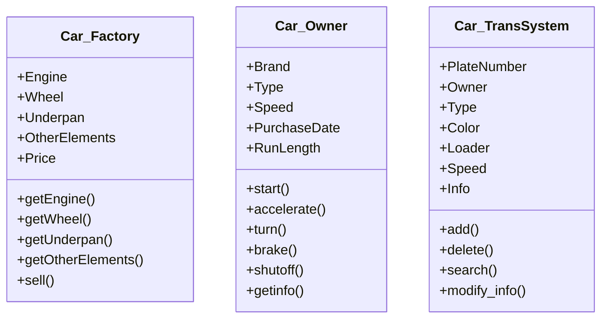

## Assignment1

### 1.书山有路勤为径...

以“图书馆借书、还书”为场景，为下面的每个实体设计一个类，并定义相关的属性和方法。

1)大学里的学生; 2)书籍; 3)大学图书馆的管理员

### 2.驾照在手好多年... 

分别从“厂家、车主、交通管理机构”3个角度，设计3个“汽车”的类，并定义相关的属性和方法。

### 鸣谢

1.[使用Mermaid语法画UML类图](https://www.cnblogs.com/mybdss/p/14958781.html)
