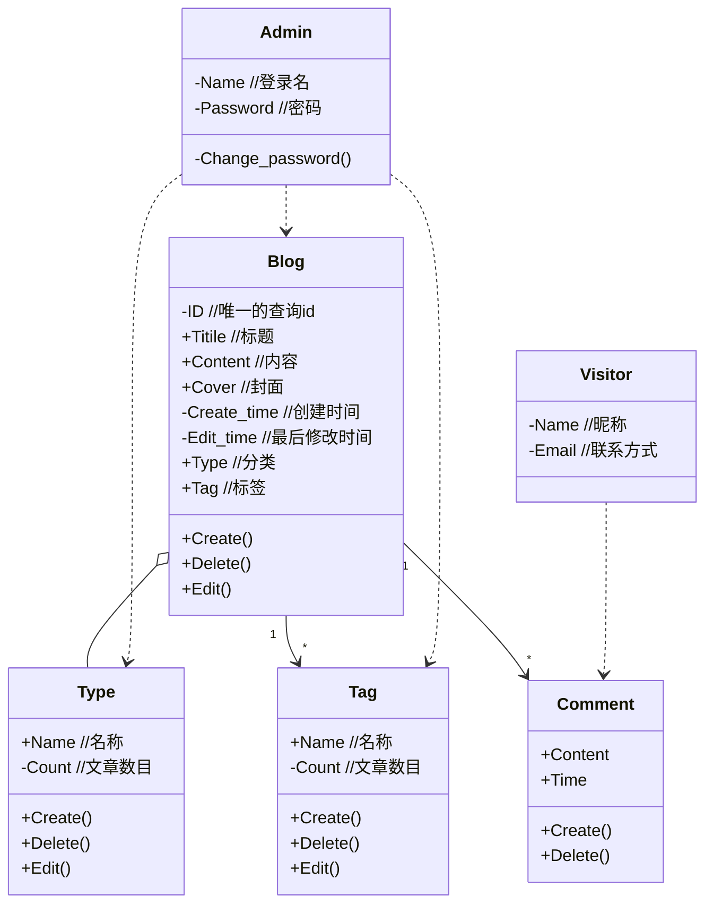

# 个人博客设计：功能分析与建模
### 要求
（1） 所选项目中拟实现的功能描述。

（2） 针对每个拟实现功能的需求分析，描述清楚操作和执行流程。

### 一、需求分析

开源和分享一直是计算机领域非常代表性的品质，许多程序员都会在博客上分享经验，前人栽树，后人乘凉。而在我的学习过程中，我越来越有了想写博客的欲望。无论是完成项目时候学习的细节知识，搭建环境时候遇到的坑，还是对自己的代码的设计解释文档。把他们写下来能够更好地梳理要点，方便日后的自己回顾查看，也有助于总结经验，造福他人。在费曼学习法和卢曼的卡片笔记法中，“从外部的知识总结提炼，转化为自己的语言教给别人”都是学习掌握知识的核心要点。

而为什么想要自己开发一个博客网页而不是去现成C姓或其他网站注册一个账号呢？ ~~因为他们总是有铺天盖地的广告，而且自己折腾才是精髓。~~ 如今信息的主要传播方式都变成了连结性很强的社交网络和社区，我很想回到多年之前博客流行的时候，拥有一个更加独立的个人空间。在这个空间里，我希望有更多的地方可以自己设计，因为我对这方面也很感兴趣。这样，除了博客的文章本身，整个博客网页也同样体现着我的技术、审美和想法。

博客的核心需求不是自己记录，而是在于将自己的所思所想分享，否则，那就跟在本地写文章没有很大区别。因此，首先需要分析作为访客的需求，再分析我 /管理员 /博客主人的需求。

#### 访客需求
1. 清晰美观的主界面。
	- 博客主人的基本信息
	- 文章汇总列表
	- 查看文章具体内容
2. 多种顺序和方式浏览想要的文章。
	- 拥有一定分类机制：分类和标签
	- 按时间线归档页面
	- 搜索功能
3. 易于阅读的文章内容。
	- 图文并茂
	- 方便回到相关文章
4. 与博客内容互动
   - 点赞
   - 评论
   - 分享

#### 管理员
1. 安全需要
	- 用户名密码登录后台管理

2. 编辑博客
	- 发布、删除博客
	- 发布后修改内容
	- 查找博客（标题或内容）
	- 最好支持markdown编辑

3. 管理博客分类
	- 基本增改删查功能
	
	  

### 二、技术选型

* 开发工具：IDEA

- 后端：
	
	- 框架：Spring Boot
	- 持久：JPA / Thymeleaf / Mybatis?
	- 数据库：MySQL
  - 日志：AOP
  
- 前端：
  
  - 在 [Element UI](https://element.eleme.cn/#/zh-CN) 、[Bootstrap](https://www.bootcss.com/)、[Semantic UI](https://semantic-ui.com)、[vuetify](https://vuetifyjs.com/zh-Hans/)、[Ant Design](https://ant.design/index-cn)、[layui ](https://www.layui.com/)等热门框架中最后选择了简洁美观好上手的 [Semantic UI](https://semantic-ui.com)。
    
    

### 三、设计

#### 1.类设计

Type 与 Tag 的差别：

- Blog 与 Type 是聚合关系，每个博客属于一个唯一分类，方便按分类查看博客，分类体现的是博客的整体属性。

- Blog 与 Tag 是一对多的关联关系，每个博客可以有好几个标签，标签体现的是博客的细节内容。

  

#### 2.界面设计

参考 [semantic-ui 官方例子](https://semantic-ui.com/usage/layout.html)与一些博客设计，初步编写了首页界面 index.html，分类页面 type.html，以及后台管理的登录页面login.html。

可以在/static目录中查看，或者在线访问用gitee pages简单部署的[页面](http://jolllly.gitee.io/ucas-oop-21au/)。

#### 3、流程设计

用 springboot 做的博客属于动态网页，不同与静态网页，它的优点在于方便对相关的数据库进行维护修改，容易实现丰富的人机交互。

动态页面响应流程：

例如，当管理员编辑文章发布时，就会根据程序代码，创建新的文章对象，修改数据库，再生成静态页面返回，反映在博客上多了一篇新的文章。

在网页处理的时候，还会遇到各种404，505错误，这种时候就需要用到面向切面编程的思想，在步骤与阶段输出当前日志，方便了解状态与debug。
