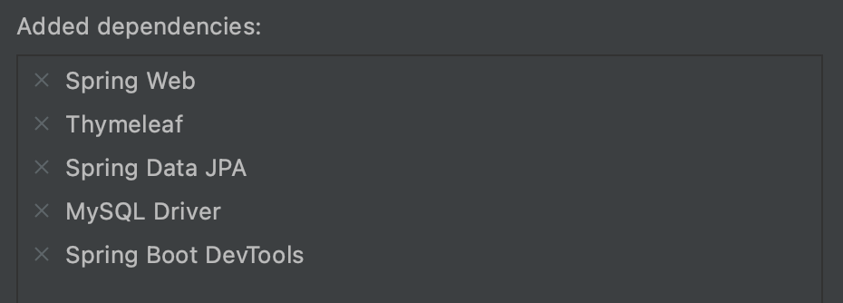
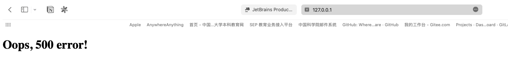
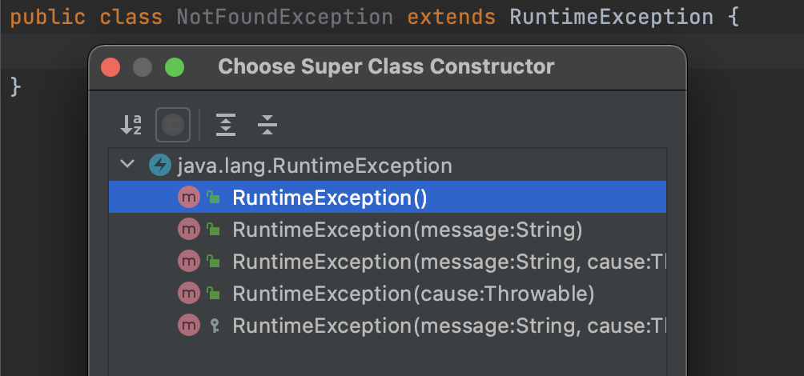
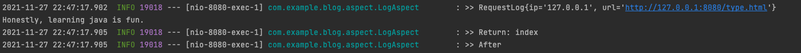
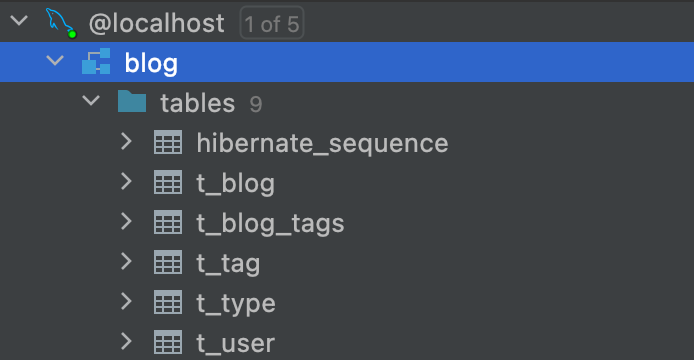
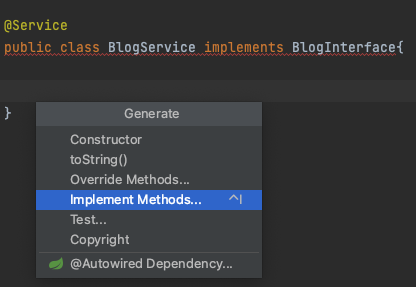

# 个人博客设计：核心流程设计分析


### 创建项目，添加依赖

IntelliJ IDEA在初始化项目的时候提供了Spring框架的选项，并且可以选择所需的依赖，我目前的依赖如下：



- Web: Spring Web，集成了tomcat与Spring MVC

- Template Engines: Thymeleaf

- SQL: JPA, MySql

这一切都由maven来管理，在`pom.xml`文件中可以看到maven自动生成的配置，创建项目后IDEA还会自动下载好需要的jar包，十分省心。

在编写过程中还发现IDEA能自动化非常多步骤，例如：

- 自动构建方法
- 自动创建setter, getter, toString等方法
- 写html的时候可以`div.class.xxxx+回车`省得打各种符号麻烦
- 待发现...

总之，写Java工程的过程中感受到的，是程序语言不断向上发展、工具不断完善带来的友好、优雅，是原来只会写C和Verilog的我从未有过的船新体验。


### 异常处理

> 王伟老师上课有曰：“大型软件80%的代码用于异常处理。“

当完成上面的简要配置，从SpringBootApplication的BlogApplication类启动项目，在浏览器访问`http://127.0.0.1:8080`端口，就能看到喜闻乐见的404 error。不过，这个错误页面Spring boot默认的，很多网页都会个性的错误页面，博客怎能不例外？

于是，先在`resources/template`目录下先创建一个简单的主页index和404, 500错误的html页面来测试。再添加一个IndexController类，通过@Controller指定它是MVC中的C，通过@GetMapping找到对应的页面。

```Java
@Controller
public class IndexController {
    @GetMapping("/")
    public String index() {
        int i = 9/0;              //这是一个错误
        return "index";
    }
}
```

在代码中添加除数为0的代码，Spring boot就会自动拦截错误，带我们进入500.html：



当我们需要更多的错误信息，就需要自己添加ExceptionHandler，通过Spring MVC提供的ModelandView跳转到error页面。这里还用到了slf4j的Logger来输出日志信息，从`LoggerFactory.getLogger(this.getClass())`这句可以看出，logger的设计运用了**工厂模式**，通过调用工厂来创建logger产品。

```Java
@ControllerAdvice
public class ControllerExceptionHandler {
    private final Logger logger = LoggerFactory.getLogger(this.getClass());

    @ExceptionHandler(Exception.class)
    public ModelAndView ExceptionHandler(HttpServletRequest request, Exception exc) throws Exception {
        logger.error("Request URL : {}, Exception : {}", request.getRequestURL(),exc);

        if (AnnotationUtils.findAnnotation(exc.getClass(), ResponseStatus.class) != null) {
            throw exc;
        }

        ModelAndView mnv = new ModelAndView();
        mnv.addObject("url",request.getRequestURL());
        mnv.addObject("exception",exc);
        mnv.addObject("message", exc.getMessage());
        mnv.setViewName("error/error");
        return mnv;
    }
}
```

但是这样又会导致跳转不到404 error了。最后的解决方法是在ResponseStatus加入NotFoundException，并且在这之前先判断，如果有就throw exception。



看，是`extends`，是**面向父类编程**的思想。RuntimeException的官方解释为“is the superclass of those exceptions that can be thrown during the normal operation of the Java Virtual Machine.” 在上图还可以看到，机智的IDEA又可以帮我们自动完成父类的方法要求。


### 日志处理

提到日志，那不得不提到**面向切面编程(AOP)**，它使得我们可以以动态的思想，跟踪目标方法的执行过程。

Spring提供了@Aspect来注解切面类，其中包含了：

- 切点： `@Pointcut`，通过excution指定切面方法
- 前置通知：`@Before`
- 后置通知：`@After`
- 方法返回：`@AfterReturning`

在LogAspect的设计中，为了方便记录request的各种信息，加入了一个私有的RequestLog类，并添加toString方法方便输出。

```Java
private class RequestLog {
        private String ip;
        private String url;
        @Override
        public String toString() {
            return "RequestLog{" +
                    "ip='" + ip + '\'' +
                    ", url='" + url + '\'' +
                    '}';
        }
        public RequestLog(String ip, String url) {
            this.ip = ip;
            this.url = url;
        }
    }
```

对Log切面的测试结果如下，可以看到成功地在每次调用IndexController的时候，都能获得ip，url和返回值，并且记录到log中。




### 构建实体类

>  “持久是对象的一种属性，利用这种属性，对象跨越时间和空间而存在。”——Grady Booch 等著，面向对象分析与设计(第3版)

由于博客的数据显然需要**持久化**，所以用到了MySql数据库与JPA (Java Persistence API)。

JPA的主要作用是充当面向对象领域与关系数据库系统的桥梁，它也是通过`@`注解的方式来完成的。

- `@Entity` ：放在类名称上，表明这个类是一个实体。

- `@Id` ：放在特定字段上，将其视为数据库中的主键。

实体的映射类型：

- `@OneToOne`：一对一

- `@ManyToOne`：多对一

  - 对于博客，多个博客同属一个分类

  - ```Java
    @ManyToOne
        private Type type;
    ```

- `@OneToMany`：一对多

  - 对于分类，分类下会有很多博客的一个List。但是它是依赖于博客对分类的映射关系的，因此要加`mappedBy`声明type是被维护端，避免修改的时候产生混乱

  - ```Java
    @OneToMany(mappedBy = "type")
        private List<Blog> blogs = new ArrayList<>();
    ```

- `@ManyToMany`：多对多

  - 一个博客可以有很多个标签，一个标签下也有多个博客。标签也是依赖博客对标签的映射的，但是比type更自由，因此还加入了一个级连操作，当blog被持久化的时候连同持久化tag。

  - ```Java
    @ManyToMany(cascade = {CascadeType.PERSIST})
        private List<Tag> tags = new ArrayList<>();
    ```

  - ```Java
    @ManyToMany(mappedBy = "tags")
        private List<Blog> blogs = new ArrayList<>();
    ```

因为之前没深入思考持久化问题，因此此处Blog, Type, Tag等类的细节跟“1-功能分析与建模”中的构想有一定偏差，请以当前实现为准。

这里给这些实体类所在包起名叫pojo (Plane Ordinary Java Object，也有说是Plane Old)，表明它是一个映射数据库的最最普通的对象，就只有setter，getter方法，不包含任何业务、持久逻辑，也没有任何继承、接口，解耦来达到简单灵活的效果。它可以像上面这样方便地加上JPA的持久化，从POJO变成PO(Persistent Object)。

完成了实体类的构建，再运行工程、refresh数据库，就会发现JPA已经自动在先前设定的blog数据库建好了表：




### 博客操作

既然blog实体类属于纯粹的pojo，那么对它的增删改查操作用**接口**写再合适不过：

```Java
public interface BlogInterface {
    Blog getBlog(long id);
    Blog createBlog(Blog blog);
    Blog updateBlog(Blog blog, Long id);
    void deleteBlog(Long id);
}
```

创建一个`BlogService`类并implements `BlogInterface`，可以看到IDEA再一次机智地自动找到了接口要求的实现方法。



因为实际的数据持久存储在数据库，对博客的操作还得有一个到数据库的接口，JPA提供了JpaRepository方便各种操作。

```JAva
public interface BlogRepository extends JpaRepository<Blog, Long> {
}
```

最后在`BlogService`中注入`BlogRepository`，并用它完善接口的实现方法。

```Java
@Service
public class BlogService implements BlogInterface{

    @Autowired
    private BlogRepository blogRepository;

    @Override
    public Blog getBlog(Long id) {
        return blogRepository.findById(id).orElseThrow(
          () -> new NotFoundException("博客不存在"));
    }

    @Override
    public Blog createBlog(Blog blog) {
        return blogRepository.save(blog);
    }

    @Override
    public Blog updateBLog(Blog blog, Long id) {
        Blog b = blogRepository.findById(id).orElseThrow(
                () -> new NotFoundException("博客不存在"));
        BeanUtils.copyProperties(blog,b);
        return blogRepository.save(b);
    }

    @Override
    public void deleteBlog(Long id) {
        blogRepository.deleteById(id);
    }
}
```

对Type，Tag的操作也是基本的增删改查，与Blog十分类似，那么我在想，是否需要进一步抽象出共用的接口呢？


### 网页渲染

//TODO

还在观望学习thymeleaf模版引擎中……


### 参考：

1. https://spring.io/projects/spring-boot
2. https://www.thymeleaf.org/index.html
3. https://developer.aliyun.com/article/769977
4. https://zetcode.com/springboot/controlleradvice/

