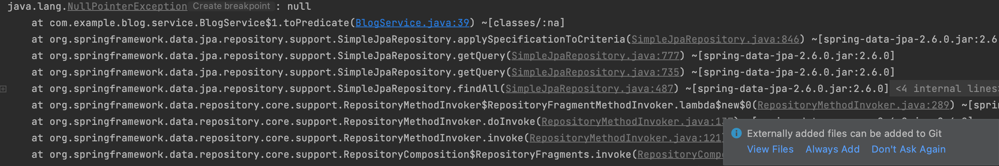

# 个人博客设计：高级设计意图

[TOC]

## 前言

到第二次作业过后，能成功依靠Spring MVC跑起网页、做一些简单异常处理、日志输出的激动逐渐淡褪。一方面，数据库与JPA框架带来的优势更加体现，另一方面，其他前端框架的不合理、复杂的交互实现等等问题也暴露出来。

本章的重点将放在高级设计意图，以框架、架构模式、设计原则的顺序层层深入，结合一些新增的具体设计实现方法，试图从本该作为应用的代码中，发掘出一些更有价值的东西。


## 框架与实现

### 数据库与JPA

在进一步实现预想的博客功能时，惊觉需要用Java，class的代码部分已经写的差不多了。为什么会这样呢？我想是因为，早在1中的设计就明确了，博客需要的类只有那么几个，操作也是非常基础的增删改查。在引入了数据库后，他们的相互关系、操作被 JPA 框架很好地抽象解耦，隐藏了底层原理，让我不用具体关注细节，而是可以直接通过数据库的接口得到结果。这极大程度体现了数据库的优越性：一方面可以将数据持久化保存，且可以支持大量的数据；另一方面通过有条理的组织，使得对数据的查询维护更加高效。

但是JPA有时候写起来也并不是那么容易，比如我想尝试实现按照标题和类型模糊查询功能，因为要查询多个表，就显得十分复杂。这里参考了一种写法，Spring Data JPA支持 JPA2.0 的 Criteria 查询，相应的接口是 `JpaSpecificationExecutor`，具有方法：

```Java
Page<T> findAll(Specification<T> spec, Pageable pageable); //分页按条件查询
List<T> findAll(Specification<T> spec); //不分页按条件查询
```

两个方法都具有 `Specification spec` 参数，用于设定查询条件。 `Specification`接口中只定义了如下一个方法：

```Java
Predicate toPredicate(Root<T> root, CriteriaQuery<?> query, CriteriaBuilder cb);
```

要使用它，首先在与数据库打交道的dao层，也就是`BlogRepository`继承`JpaSpecificationExecutor`：

```Java
public interface BlogRepository extends JpaRepository<Blog, Long>, JpaSpecificationExecutor<Blog> {

}
```

然后调用它的方法，通过`CriteriaBuilder` 的`like`方法创建查询条件，最后反馈给JPA，让它帮我实现想要的查询功能。

```java
@Override
    public Page<Blog> listBlog(Pageable pageable, Blog blog) {
        return blogRepository.findAll(new Specification<Blog>() {
            @Override
            public Predicate toPredicate(Root<Blog> root, CriteriaQuery<?> query, CriteriaBuilder criteriaBuilder) {
                List<Predicate> predicates = new ArrayList<>();
                if(!blog.getTitle().isEmpty()) {
                    predicates.add(criteriaBuilder.like(root.<String>get("title"),"%"+blog.getTitle()+"%"));
                }
                if(blog.getType().getId() != null) {
                    predicates.add(criteriaBuilder.equal(root.<Type>get("type").get("id"), blog.getType().getId()));
                }
                if(blog.isRecommend()) {
                    predicates.add(criteriaBuilder.equal(root.<boolean>get("recommend"), blog.isRecommend()))
                }
                query.where(predicates.toArray(new Predicate[predicates.size()]));
                return null;
            }
        },pageable);
    }
```

以上一顿操作，充分体现了**接口**的重要性。假如我们开发一个类似JPA这样的功能部件时，各种操作一定是以接口的方式呈现给使用者的。它也使得我可以通过**面向对象，而非面向数据库**的语言查询数据，避免程序的 sql 语句紧密耦合。


### 新增的VO层

然而，这一顿操作后遇到的是空指针报错，这似乎是因为在前端输入的查询form表单不能自动封装成 blog 类型的实例，此时`BlogService`操作中 blog 是仍然是空的，那么`blog.getType().getId() `这句就会出现问题。



因此为了传递查询的数据，需要增加一层**View Object**（VO），新封装一个对象`BlogQuery`，它的域是在查询的时候输入的那些条件：标题，分类，是否推荐。


需要一起修改的是`BlogInterface`接口中的查询时 `listBlog`方法，和`BlogService`中的具体实现。每当查询操作时，传入的都是`BlogQuery`类，这样便不再会遇到`blog`没有实例的问题。

```Java
 public Page<Blog> listBlog(Pageable pageable, BlogQuery blog);
```

通过以上这个小小困难，其实已经隐约反映出了我遇到的一个大大困难——


### 令人头疼的模版引擎

事到如今，我才意识到这个严重的问题：相比于后端的逻辑，自己写博客甚至是一个更重前端的任务。

首先，博客的最终目的在于展示给读者，这意味着我得自己设计每个界面，各个区域、按钮与对应的功能，即使已经使用了现成UI库依旧被折磨得不轻。

其次，设想的是博客直接使用模版引擎会比较简单，毕竟动态的展示区域有限，那么只用获取后端传来的实体类信息，用模版引擎在页面上替换即可。但是理想很丰满，现实很骨感，用户在网页上还是有各种各样的复杂操作，包括一些按钮的JS逻辑，导致写起来完全没有想象中那么简单。同时thymyleaf模版引擎对我来说并不是很好用，对与前后端也没有那么分离，经常会在设计中相互依赖。

吐槽了这么多，我想，前端展示应该不是本门课程的重点，琐碎的实现细节中，也难以体现什么面向对象的设计思想。在精力与能力有限的情况下，只能舍弃这部分功能，放弃前后端交互的各种bug，让他们暂时实现不了交互的响应，停留在静态页面吧。

*后台列表查询页面设计展示：*


*新增博客编辑页面设计展示（markdown编辑器集成的是editormd）：*


## 三层架构模式

​	首先，我看了挺多介绍，也没有很搞清楚三层架构来源、定义和与MVC的确切关系。但我想，它或许是随着生产设计中复杂程度增加，而不断迭代、自然涌现出的一种模式，相比MVC和其他设计模式，更强调整体的架构部署规范。

​	**三层架构**是为了符合“高内聚，低耦合”思想，把各个功能模块划分为表示层（UI）、业务逻辑层（BLL）和数据访问层（DAL）三层架构，各层之间采用接口相互访问，并通过对象模型的实体类（Model）作为数据传递的载体。不同的对象模型的实体类一般对应于数据库的不同表，实体类的属性与数据库表的字段名一致。[^1]也有一说，三层架构的三层是表现层（web）、业务逻辑层 （service）、持久层（dao）。

​	在我的设计中，可以清晰体现出这样的三层架构思想。


#### 表示层（**UI**层）

表示层也称为界面层，位于最外层，离用户最近。用于显示数据和接收用户输入的数据，为用户提供一种交互式操作的界面。

#### 业务逻辑层（**BLL**层）

连结上下两层，负责关键业务的处理和数据的传递。复杂的逻辑判断和涉及到数据库的数据验证都需要在此做出处理。主要是针对具体的问题的操作，也可以理解成对数据层的操作，对数据业务逻辑处理。

#### 数据访问层（**DAL**层）

主要负责对数据库的直接访问，为业务逻辑层提供数据，根据传入的值来操作数据库，增、删、改、查。	

#### 实体类

在2中提到，blog、type、tag的实体类设计采用了最简单的POJO，这样，实体类作为数据传输的载体，在以上三个层中灵活穿梭、传递数据。用操作系统的比喻来说，数据库中的数据就像是存储在硬盘中，拥有持久化属性。而我们需要用的时候，要先把它在内存中建立一份拷贝，再根据不同的应用递给不同的位置。


在课堂研讨的时候也用了一个更贴近生活的比喻：表现层就像营业员，负责接收用户请求；业务逻辑层就像厨师，可以将原材料加工处理；数据访问层就像采购员，负责从数据库得到数据。

#### 三层架构的优劣势

三层架构以一种标准化的方式，降低了层间依赖，实现解耦，有利于代码复用调整，但劣势也是很明显的。

现在看来，我的整个工程代码量实在算不上很大，而三层架构更适用于大的项目，方便多个开发人员对每一层单独维护。当我只有一个人的时候，这个优势就不是那么明显了，反而有过度设计的嫌疑。

其次，层次多有时候会导致级联的修改，尤其体现在自上而下的方向。比如当我增加了查询与VO层的时候，就自上而下进行了一番从`blog`到`blogQuery`的修改。如果要再在前端提出新的要求，在表示层中增加一个功能，则需要在相应的业务逻辑层和数据访问层中都增加相应的代码。

[^1]: 陈焕彬.浅谈.NET三层架构在系统开发中的应用.J.电脑与信息技术,2016,24(05):45-47.
[^2]: [Java三层架构详解](https://www.cnblogs.com/1994-12/p/9958274.html)


## 设计原则


以上是目前通过IDEA生成的类关系图，可以看出尽量还是保证了清晰明了，在这些设计中，能找到不少设计原则的体现。

#### 单一职责原则（SRP）

> There should never be more than one reason for a class to change.

Blog，Type，Tag及其对应的Reposity，Interface，Service都是单独的类，每个类的职责都很明确，一个类只有一个发生变化的原因。

每个类的功能一目了然，极大提高了代码的可读性，也提高了系统的可维护性。

#### 开闭原则（OCP）

> Software entities like classes, modules and functions should be open for extension but closed for modification.

在得到了基础的增删改查操作后，要增加新的页面比如Type的查询控制，并在上面实现各种操作，只需要创建新的Controller类进行扩展，而不需要再修改已有的代码。用抽象构建架构，用实现扩展细节。

#### 迪米特法则（LOD）

>Talk only to your immediate friends and not to strangers.

在分层后，Service层作为中介，避免了与数据库的直接调用，每一层都只与临近类交互，逻辑也尽量封装在类内部，降低类之间的耦合度，极大提高模块的相对独立性。

#### 接口隔离原则

>Clients should not be forced to depend upon interfaces that they don`t use.
>The dependency of one class to another one should depend on the smallest possible.

在2中提到了一个问题：“是否需要进一步抽象出共用的接口呢？“接口隔离原则给出了答案。不要试图去建立一个很庞大的接口供所有依赖它的类去调用，而是应该像现在这样，一个接口服务于一个对应的子模块，增删改查都是针对具体一类的操作。这样屏蔽了冗余的接口，提高了系统的内聚性、稳定性。

#### 依赖倒置原则（DIP）

> High level modules should not depend upon low level modules. Both should depend upon abstractions.
> Abstractions should not depend upon details. Details should depend upon abstractions.

在项目中，封装数据库操作可认为是低层模块，而处理业务逻辑可认为是高层模块。如果处理业务逻辑需要依赖封装数据库操作的代码，会导致实现进度的困难。通过 Repository 继承 JPA Repository，为高层提供了一个封装好数据库操作的抽象接口，使得高层不依赖低层，高低层细节都依赖抽象。


## 总结体会

在复杂应用的开发中，应该说已经离不开各种框架了，甚至有笑话说Java程序员都成了Spring程序员。我对于这些框架也基本持开放拥抱的态度，而不是有胆量从底层开始写轮子。虽然我只站在设计层次看到他们的抽象，而没有选择源码阅读深入原理。但在听了大家的源码阅读汇报后，也知道在这背后，是框架利用面向对象思想完善的设计，才使得我们可以方便地使用各种功能，极大提高了项目代码的重用性、灵活性、扩展性，也极大提高了程序员的编程体验。

但是这种编程与我们过去学习中熟悉的感觉其实是不太一样的。比如Verilog语言，核心其实在于理解电路，语言只是辅助表达。c语言面向过程编程，核心在于理解算法功能，就可以顺着写出整个逻辑。但是应用了各种框架的Java则不一样，更多时候是先有应用需求，然后再在现成能提供的功能中寻找可以完成的方式。而这其中有非常多经验性的东西，从持久层选用Mybatis还是JPA，到每个框架具体API的操作。而我对这些框架的了解掌握确实非常少，因此在本项目中，我其实还是靠着一些现有的例子照猫画虎，不具有很强的自主性，更不能说经历了这个项目，就对用到的框架有了很好的掌握。

另一方面，对抽象的过度依赖总还是有不安的，如果我熟悉了一个框架的应用，而过几年大家开始流行用另一个框架，那这些经验基本上可以说付诸东流，难怪程序员总有着被后浪拍死在沙滩上的压力。从这里能体会到老师注重面向对象思想层次的讲解、而不是直接开始各种技术就业培训的意义。这或许也是国科大注重计算机基础课程的一点优势吧。

由于这些原因，可能之后并不一定能坚持继续维护这个项目，并将它真正作为自己的博客来使用。往后想，就算我完成了功能，写出了自己满意的前端，到需要部署到服务器时，我估计还不如选用github pages支持的hexo，Jekyll等等。虽说写搭建个人博客本就是很复古的操作，但我采用的这些设计，放在当前年代下还是显得有些过时，可以被更优雅方便的方式替代。比较可惜，没有完成老师将来能把项目写在简历上的期望。但是回顾一次次探索、思考与形成的文档，依然算得上收获颇丰。