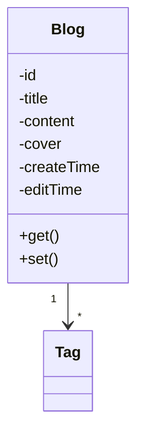
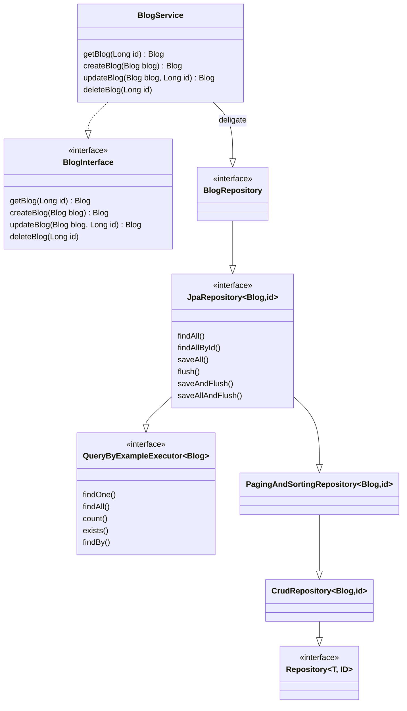

```mermaid
classDiagram
class Blog {
	-id         
	-title   
	-content      
	-cover      
	-createTime  
	-editTime
	+get()
	+set()
}


Blog "1" --> "*" Tag

```

```mermaid
classDiagram


class BlogInterface {
    <<interface>>
    getBlog(Long id) Blog
    createBlog(Blog blog) Blog
    updateBlog(Blog blog, Long id) Blog
    deleteBlog(Long id)
}

class BlogService {
    getBlog(Long id) Blog
    createBlog(Blog blog) Blog
    updateBlog(Blog blog, Long id) Blog
    deleteBlog(Long id)
}

class Repository~T, ID~{
	<<interface>>
}

class QueryByExampleExecutor~Blog~{
<<interface>>
    findOne()
    findAll()
    count()
    exists()
    findBy()
}

class BlogRepository{
    <<interface>>
}

class JpaRepository~Blog,id~{
    <<interface>>
    findAll()
    findAllById()
    saveAll()
    flush()
    saveAndFlush()
    saveAllAndFlush()
}

BlogService --|> BlogRepository: deligate
BlogService ..|> BlogInterface
BlogRepository --|> JpaRepository~Blog,id~
JpaRepository~Blog,id~ --|> PagingAndSortingRepository~Blog,id~
JpaRepository~Blog,id~ --|> QueryByExampleExecutor~Blog~
PagingAndSortingRepository~Blog,id~ --|> CrudRepository~Blog,id~
CrudRepository~Blog,id~ --|> Repository~Blog, id~
            


```

